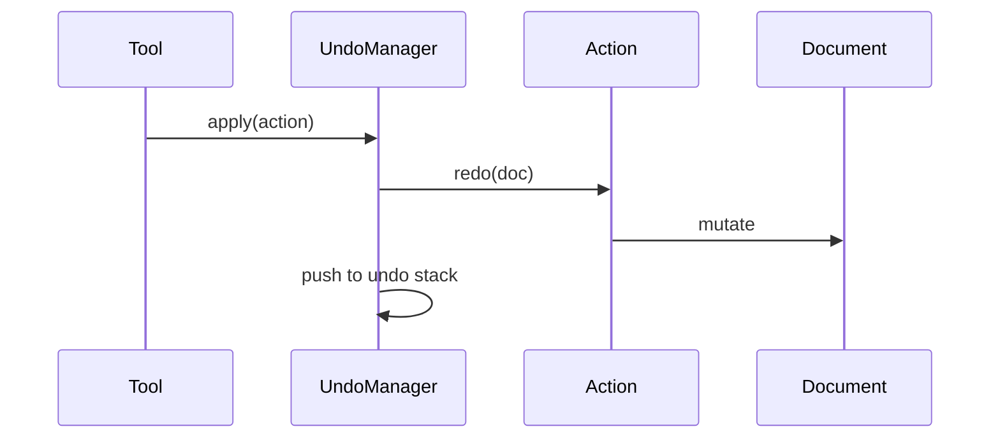
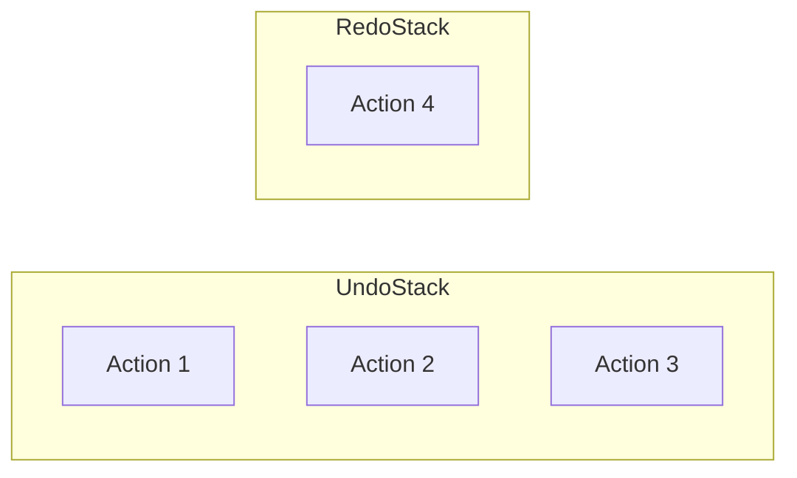

# Action and Undo System

All document changes go through actions. An action knows how to apply a change and how to reverse it.

## The Action Interface

```typescript
interface UndoableAction {
  redo(doc: DrawingDocument): void;
  undo(doc: DrawingDocument): void;
}
```

Both methods receive the document and mutate it directly. `redo` applies the change; `undo` reverses it.

## Redo-First Design

When you commit an action, the system calls `redo`, not a separate "do" method:



No distinction between first apply and reapply after undo.

## Recording Undo Data

Actions capture what they need to reverse themselves. `AddShape` keeps the shape:

```typescript
class AddShape implements UndoableAction {
  constructor(private shape: Shape) {}

  redo(doc: DrawingDocument): void {
    doc.shapes[this.shape.id] = this.shape;
  }

  undo(doc: DrawingDocument): void {
    delete doc.shapes[this.shape.id];
  }
}
```

Actions that modify existing data capture previous state during `redo`:

```typescript
redo(doc: DrawingDocument): void {
  const shape = doc.shapes[this.shapeId];
  this.previousTransform = shape.transform;  // capture for undo
  shape.transform = this.newTransform;
}
```

## The Undo Manager

Two stacks:



- `apply(action)` — calls `redo`, pushes to undo stack, clears redo stack
- `undo()` — pops from undo, calls `undo`, pushes to redo
- `redo()` — pops from redo, calls `redo`, pushes to undo

New actions clear the redo stack.

## Composite Actions

Multiple changes that should undo together:

```typescript
class CompositeAction implements UndoableAction {
  constructor(private actions: UndoableAction[]) {}

  redo(doc): void {
    this.actions.forEach(a => a.redo(doc));
  }

  undo(doc): void {
    // Reverse order
    [...this.actions].reverse().forEach(a => a.undo(doc));
  }
}
```

Moving multiple selected shapes creates one `CompositeAction`. One undo reverts all.

## Available Actions

| Action | Purpose |
|--------|---------|
| `AddShape` | Insert shape |
| `DeleteShape` | Remove shape |
| `UpdateShapeGeometry` | Change geometry |
| `UpdateShapeTransform` | Change position/rotation/scale |
| `UpdateShapeFill` | Change fill |
| `UpdateShapeStroke` | Change stroke |
| `UpdateShapeOpacity` | Change opacity |
| `UpdateZIndex` | Change stacking order |
| `CompositeAction` | Group actions |
