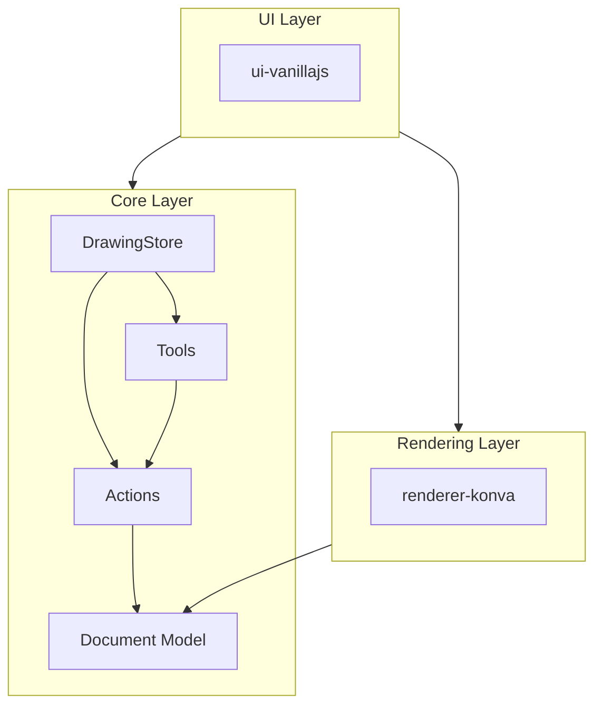
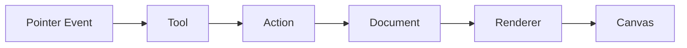

# Architecture Overview

Smalldraw separates concerns into three layers: core logic, rendering, and UI.

**Core** (`@smalldraw/core`) contains the document model, tools, actions, and undo system. It has no dependencies on rendering or DOM APIs.

**Renderer** (`@smalldraw/renderer-konva`) translates the document model into Konva canvas elements. It doesn't know about tools or interaction.

**UI** (`@smalldraw/ui-vanillajs`) handles DOM, pointer events, and toolbar. It connects user input to tools and triggers re-renders.

## Data Flow

Data flows in one direction:

The UI dispatches pointer events to the active tool. The tool creates an action. The action mutates the document. The renderer draws the result. Every visual change traces back to an action.

## The DrawingStore

The `DrawingStore` coordinates everything. It holds the document, the active tool, and the undo manager. To build a UI, you create a store, register tools, and pipe pointer events to it.

## Where to Find Things

| If you want to... | Look in... |
|-------------------|------------|
| Understand shape data | `core/model/` |
| See how tools work | `core/tools/` |
| Understand undo/redo | `core/undo.ts`, `core/actions/` |
| See how shapes render | `renderer-konva/shapes.ts` |
| See a complete UI | `ui-vanillajs/` |

## Why This Structure

**Testable.** Core logic runs anywhere. Unit test tools and actions without a browser.

**Swappable rendering.** Write `renderer-svg` or `renderer-pdf` without touching core.

**Custom UIs.** The vanilla UI is one implementation. Use React, Vue, or anything else by wiring up the store yourself.

**Predictable state.** All changes flow through actions. Log them, replay them, or sync them for collaboration.
