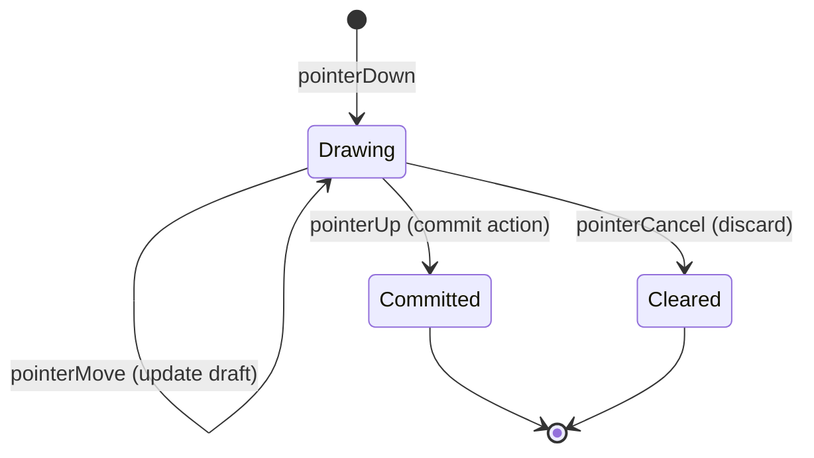

# Draft Shapes

When you draw a stroke, you see it appear immediately—before you lift your finger. This in-progress preview is a draft shape.

## What Drafts Are

A draft renders on the canvas but isn't in the document. It's temporary visual feedback.

```typescript
interface DraftShape extends Shape {
  toolId: string;
  temporary: true;
}
```

Same structure as regular shapes, plus metadata identifying which tool created it.

## Why Drafts Exist

Without drafts, tools would commit shapes immediately, then update them as the interaction continues. This would pollute undo history with intermediate states and make canceling awkward.

Drafts keep in-progress work outside the document until it's final.

## The Draft Lifecycle



On commit, the tool creates an action with the final geometry and clears the draft. On cancel, it just clears.

## Rendering

The UI merges document shapes and drafts before rendering:

```
render(documentShapes + draftShapes)
```

Drafts use the same rendering code as document shapes. No special handling needed.

## Managing Drafts

- `runtime.setDraft(shape)` — set or replace the draft
- `runtime.setDrafts(shapes)` — set multiple drafts
- `runtime.clearDraft()` — remove drafts for this tool

Drafts are scoped by tool. When a tool deactivates, its drafts clear automatically.

## Draft vs Document

| Aspect | Draft | Document |
|--------|-------|----------|
| Persisted | No | Yes |
| In undo history | No | Yes |
| Survives tool switch | No | Yes |
| Rendered | Yes | Yes |

The transition is explicit: commit an action. Until then, the shape is temporary feedback.
