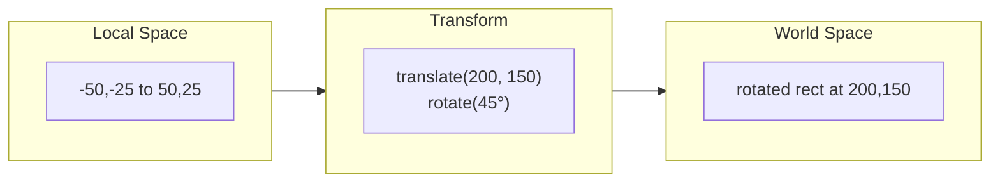

# Geometry Local Space

Shapes use two coordinate systems: local space for geometry, world space for document position.

## Local vs World

**Local space** is relative to the shape's center. A 100×50 rectangle spans (-50, -25) to (50, 25)—centered at the origin.

**World space** is the document. Apply the transform to convert local to world.



## Why Local Space

**Rotation.** Just change the angle. Geometry stays the same.

**Scaling.** Multiply local coordinates directly.

**Bounds.** Local bounds are constant. World bounds = transform corners.

If geometry were in world space, rotating would recalculate every point.

## Local Bounds by Geometry Type

| Geometry | Local Bounds |
|----------|--------------|
| `rect` | `(-width/2, -height/2)` to `(width/2, height/2)` |
| `ellipse` | `(-radiusX, -radiusY)` to `(radiusX, radiusY)` |
| `regularPolygon` | `(-radius, -radius)` to `(radius, radius)` |
| `pen`, `stroke`, `polygon` | bounding box of points |
| `path`, `bezier` | bounding box of all points/handles |

For rect/ellipse, the center is (0, 0) by definition. For point-based geometries, canonicalization shifts points to be relative to their center.

## Converting Between Spaces

Local point to world:

```typescript
function applyTransformToPoint(point, transform): Point {
  // 1. Scale around origin
  // 2. Rotate around origin
  // 3. Translate to world position
}
```

Shape to world bounds:

```typescript
function getShapeBounds(shape): Bounds {
  const localBounds = getGeometryLocalBounds(shape.geometry);
  const corners = [topLeft, topRight, bottomRight, bottomLeft];
  const worldCorners = corners.map(c => applyTransformToPoint(c, shape.transform));
  return boundingBoxOf(worldCorners);
}
```

World bounds of a rotated shape is axis-aligned—larger than local bounds.

## When Each Space Matters

**Local space:** geometry definition, rendering, geometry-specific calculations

**World space:** hit testing, selection frames, handle positioning, distances between shapes

## Rendering

The Konva renderer works in local space:

1. Create a group with the shape's transform
2. Draw geometry at the origin

The group's transform handles local-to-world conversion. The renderer never computes world positions for individual points.
