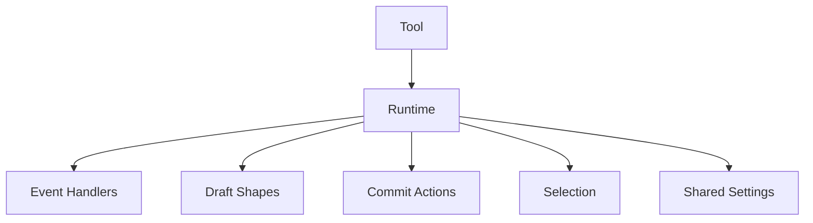
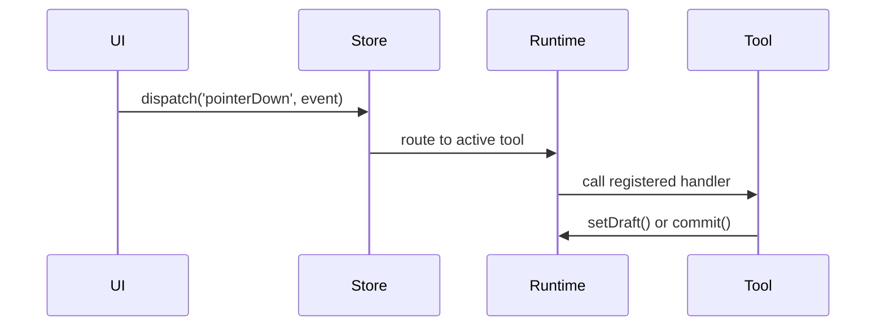

# Tool Runtime Model

Tools don't manipulate the document or render anything directly. They interact with a runtime that provides controlled access to the system.

## What a Tool Is

A tool is an object with an `id`, a `label`, and an `activate` function:

```typescript
interface ToolDefinition {
  id: string;
  label: string;
  activate(runtime: ToolRuntime): void | undefined | (() => void);
  // activate()'s return value is run at deactivation time
}
```

When activated, the tool receives a runtime. It uses this runtime to handle events, show previews, and commit changes.

## The Runtime as a Sandbox

The `ToolRuntime` gives the tool controlled capabilities:



**Event subscription.** Tools receive pointer events through `runtime.on()`, not DOM events directly.

**Draft shapes.** `runtime.setDraft()` shows in-progress work that renders but isn't in the document.

**Actions.** `runtime.commit(action)` changes the document. Tools can't mutate it directly.

**Selection.** `runtime.getSelection()` and `runtime.setSelection()` manage what's selected.

**Settings.** `runtime.getSharedSettings()` provides stroke color, fill, and other shared state.

## Event Flow



Events the tool can subscribe to:

- `pointerDown` — press
- `pointerMove` — drag or movement
- `pointerUp` — release
- `pointerCancel` — interrupted
- `hover` — movement without button

## Why Tools Can't Mutate Directly

**Undo works automatically.** Actions know how to undo themselves.

**Consistent state.** All changes flow through actions. Log them, replay them, sync them.

**Testability.** Test tools by checking what actions they commit.

## Tool Lifecycle

1. **Registration.** Store learns about available tools
2. **Activation.** `activate(runtime)` called when tool selected
3. **Interaction.** Tool handles events, sets drafts, commits actions
4. **Deactivation.** `activate()`'s return value is called when switching away

The runtime persists. State stored with `runtime.setToolState()` survives deactivation.

## Tool-to-UI Communication

Tools emit events for the UI:

- `handles` — interactive handle positions (for resize/rotate)
- `handle-hover` — which handle the cursor is over
- `selection-frame` — bounds during drag selection

The UI listens with `runtime.onEvent()` and renders accordingly. This decouples tools from specific UI implementations.
